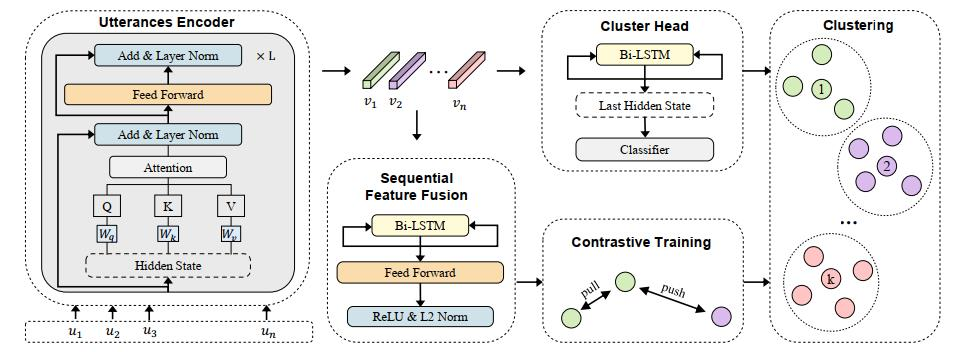

[](https://opensource.org/licenses/MIT)


## CluCDD

This includes an original implementation of CluCDD:  Contrastive Dialogue Disentanglement via Clustering. The paper is accepted at IWCIM 2023.

## Get Started

- An effective framework for dialogue disentanglement. The model captures the utterances and sequential representations in dialogues.
- The contrastive training paradigm is employed to amend feature space, and a cluster head predicts the
  session number to enhance the final clustering result.
- Extensive experiments demonstrate that our CluCDD is suitable for solving dialogue disentanglement and establishes the state-of-the-art on two datasets  



## Setting Up

Our codebase requires the following Python and PyTorch versions:

- Python >= 3.7
- PyTorch >= 1.7.1 
- transformers

### Training and Evaluate

To train CluCDD with a single GPU, run :

```
python train_clucdd.py --do_train
```

To evaluate CluCDD with a saved checkpoint:

```
python train_clucdd.py --do_test --model_path <THE PATH OF THE SAVED CHECKPOINT>
```

### Acknowledgments
This work was supported by the National Natural Science Foundation of China under Projects (Grant No. 61977045 and Grant No. 81974276).
If you have further questions and suggestions, please feel free to contact us (gaojingsheng@sjtu.edu.cn).

